# Chess Game Analysis: kar2on vs Viv_1137

- **Result:** 1-0
- **Date:** 2026.03.23
- **Opening:** French Defense Knight Variation

### Move 1 (White): e4
**Engine Recommendation:** The engine recommends `e4`. This is a classic opening move that immediately controls the center and opens lines for the queen and king's bishop.
**Actual Move:** White played `e4`. This is an excellent, standard opening move.
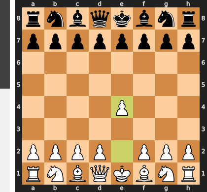

### Move 1 (Black): e6
**Engine Recommendation:** The engine suggests `e5`, directly challenging white's central control. This is a very common and strong response.
**Actual Move:** Black played `e6`. This move prepares to fianchetto the dark-squared bishop or to play d5, establishing a pawn chain. This leads to a French Defense, a solid and strategic opening.
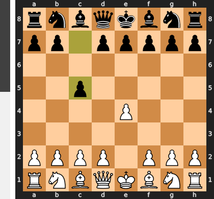

### Move 2 (White): Nf3
**Engine Recommendation:** The engine suggests `Nc3`, developing a knight to a central square and preparing to control d4.
**Actual Move:** White played `Nf3`. This is a natural developing move, controlling the center and preparing for kingside castling. Both `Nc3` and `Nf3` are standard responses in the French Defense.
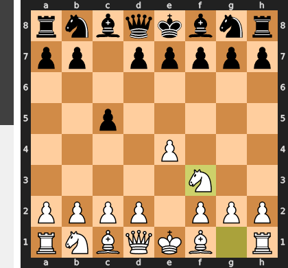

### Move 2 (Black): d6
**Engine Recommendation:** The engine suggests `d5`. This is the thematic pawn break in the French Defense, directly challenging White's central pawn on e4 and opening lines for Black's pieces.
**Actual Move:** Black played `d6`. While not a bad move, it's a bit more passive than `d5`. It supports `e5` and prepares to develop the bishop to `e7` or `g7`, but it can give White a tempo advantage in controlling the center.
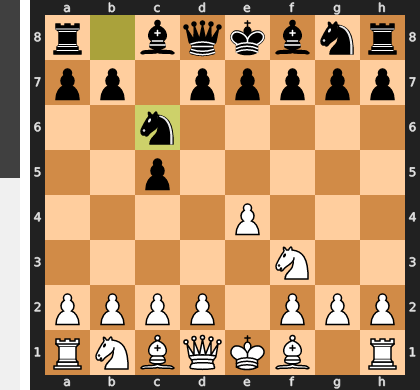

### Move 3 (White): Bc4
**Engine Recommendation:** The engine suggests `d4`, which would solidify White's central control and open lines for the queen and bishop. This is a very strong and natural move in this position.
**Actual Move:** White played `Bc4`. This is a good developing move, placing the bishop on an active square where it eyes Black's kingside and prepares for potential tactics on f7. While solid, it doesn't immediately challenge Black's center as `d4` would.
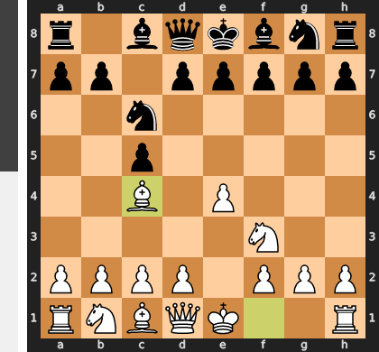

### Move 3 (Black): c6
**Engine Recommendation:** The engine suggests `d5`, directly striking at White's central pawn and developing a natural pawn structure in the French Defense. This would equalize the position.
**Actual Move:** Black played `c6`. This move prepares `d5` and offers support to the queen side. However, it's a bit passive and allows White to continue developing without much pressure. Black might be better served by a more active central play.
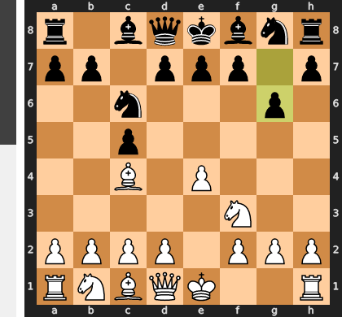

### Move 4 (White): Nc3
**Engine Recommendation:** The engine suggests `d4`, which would establish a strong pawn center for White and gain a space advantage.
**Actual Move:** White played `Nc3`. This is a developing move, bringing another piece into the game and controlling important central squares. It's a solid choice, and while `d4` was also good, `Nc3` keeps flexibility.
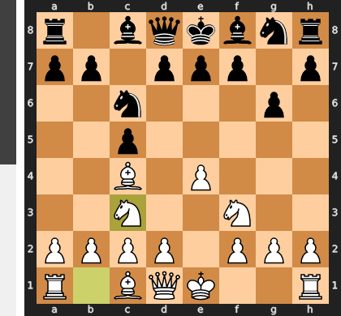

### Move 4 (Black): a6
**Engine Recommendation:** The engine suggests `b5`, which would attack White's bishop on c4 and gain a tempo for Black. This would be a more active approach.
**Actual Move:** Black played `a6`. This move prepares `b5` but loses a tempo. While it has a purpose, it doesn't create immediate threats or challenge White's development, allowing White to continue developing unhindered.
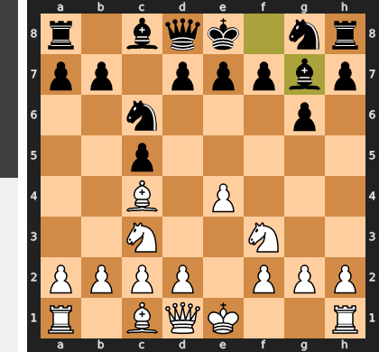

### Move 5 (White): O-O
**Engine Recommendation:** The engine suggests `d4`, continuing to emphasize central control and creating attacking opportunities. This would likely give White a significant advantage.
**Actual Move:** White played `O-O`. This is a crucial move for king safety and brings the rook into the game. It's a good, solid developing move, though it still delays the central pawn push that the engine favors.
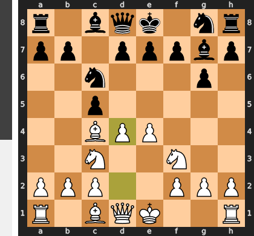

### Move 5 (Black): a5
**Engine Recommendation:** The engine suggests `b5`, which would attack the bishop on c4 and gain time for Black. This is the more active and appropriate response in this situation.
**Actual Move:** Black played `a5`. This move is a bit puzzling. It prevents White from playing `b4` but doesn't contribute to Black's development or central control. It could be a precursor to `b6` and `Bb7`, but it's a slow and somewhat passive move that might lose Black some initiative.
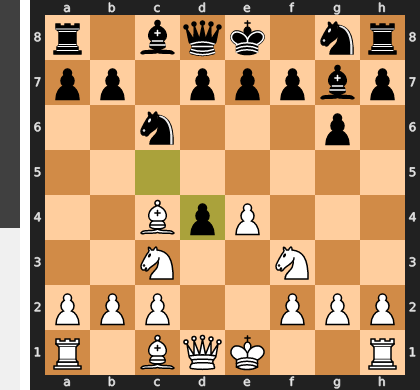

### Move 6 (White): d4
**Engine Recommendation:** The engine correctly suggests `d4`. This move establishes a strong central pawn presence, controls key squares, and opens lines for the queen and bishop. It's a crucial move for White to gain an advantage.
**Actual Move:** White played `d4`. Excellent! White finally plays the engine's recommended move, asserting strong central control and gaining a significant advantage. This move creates tension in the center and challenges Black to respond actively.
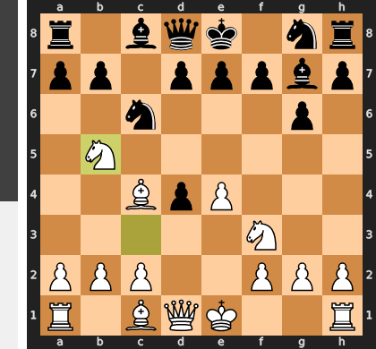

### Move 6 (Black): b5
**Engine Recommendation:** The engine suggests `Nf6`, developing a knight and contesting the center. This would be a more balanced approach for Black.
**Actual Move:** Black played `b5`, attacking the bishop on c4. While this forces the bishop to move, Black's earlier passive moves mean that White's central advantage is already significant. This move doesn't solve Black's fundamental problems in the center and might even weaken the queenside.
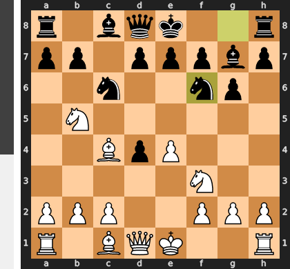

### Move 7 (White): Be2
**Engine Recommendation:** The engine suggests `Bd3`, placing the bishop on a more active square where it controls important diagonals and exerts pressure on Black's kingside.
**Actual Move:** White played `Be2`. This is a solid developing move that prepares for quick kingside castling. However, it's a bit passive compared to `Bd3`, as the bishop on e2 is less active and blocks the queen's diagonal. White is still in a good position but missed an opportunity for a more active development.
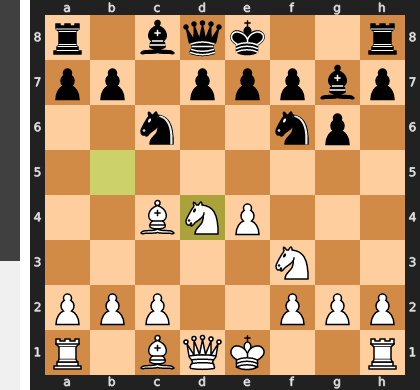

### Move 7 (Black): a4
**Engine Recommendation:** The engine suggests `b4`, which would attack the knight on c3, create tactical opportunities, and potentially weaken White's pawn structure on the queenside.
**Actual Move:** Black played `a4`. This move is again a slow pawn move, which doesn't develop pieces or directly challenge White's central advantage. While it might aim to create some weaknesses on White's queenside, it is not as effective as `b4` and allows White to continue developing without much pressure.
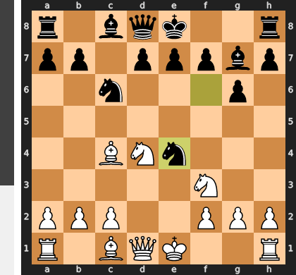

### Move 8 (White): b3
**Engine Recommendation:** The engine suggests `Bd3`, activating the bishop and maintaining central pressure.
**Actual Move:** White played `b3`. This move is a preventative measure, stopping Black from playing `b4` and attacking the knight on c3. While it addresses a potential threat, it is a pawn move that doesn't develop a piece, and it slightly weakens the queenside. It might have been more beneficial to continue developing.
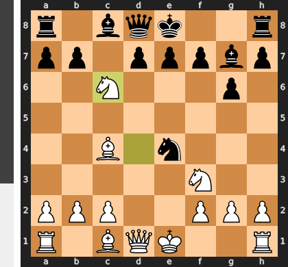

### Move 8 (Black): Bb7
**Engine Recommendation:** The engine suggests `Nf6`, developing the knight and exerting influence over the center.
**Actual Move:** Black played `Bb7`. This is a good developing move, placing the bishop on an active diagonal where it eyes White's e4 pawn and potentially supports a future `d5` push. It's a solid and sensible move.
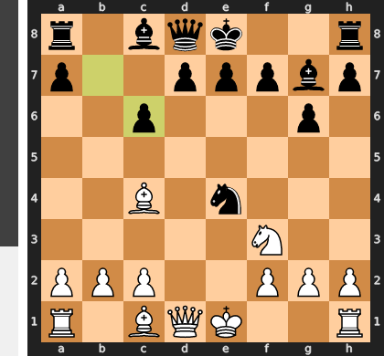

### Move 9 (White): d5
**Engine Recommendation:** The engine correctly suggests `d5`. This powerful central pawn push gains space, attacks Black's knight on c6 (should it develop there), and opens lines for White's pieces, further increasing White's advantage.
**Actual Move:** White played `d5`. Excellent! White continues to play strongly in the center, gaining a significant space advantage and creating tactical opportunities. This move puts Black under pressure and forces a response.
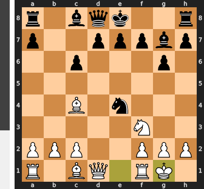

### Move 9 (Black): Ba6
**Engine Recommendation:** The engine suggests `axb3`, opening the a-file for Black's rook and exchanging a pawn. This would relieve some pressure and create counterplay.
**Actual Move:** Black played `Ba6`. This move develops the bishop but doesn't directly address the central tension created by `d5`. It aims to exchange the bishop for the knight on c3 or apply pressure on the c4 square. However, it might be a bit too slow, and Black's priority should be to deal with the central challenges.
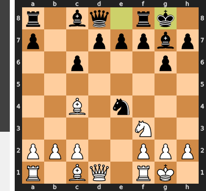

### Move 10 (White): dxc6
**Engine Recommendation:** The engine suggests `dxe6`, opening the e-file and creating an isolated pawn for Black, which could be a long-term weakness. This would maintain a significant advantage.
**Actual Move:** White played `dxc6`. This is a strong move, winning a pawn and opening the d-file for the rook. While `dxe6` was also strong, `dxc6` creates immediate material advantage and simplifies the position. White's advantage is growing.
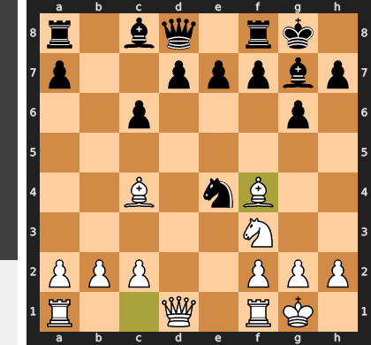

### Move 10 (Black): Nxc6
**Engine Recommendation:** The engine suggests `Nxc6`. This is the only reasonable recapture, bringing the knight to a central square and retrieving the pawn.
**Actual Move:** Black played `Nxc6`. This is a necessary recapture. Black's knight is now developed to a central square, but White maintains a strong advantage due to better central control and development.
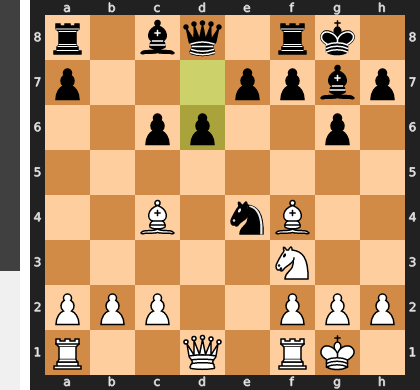

### Move 11 (White): Nxb5
**Engine Recommendation:** The engine suggests `Bxb5`, capturing the pawn and developing the bishop to an active square. This maintains White's strong advantage.
**Actual Move:** White played `Nxb5`. This is a good move that captures the pawn, gains material, and develops the knight to an active square. White has a clear material and positional advantage, demonstrating excellent play.
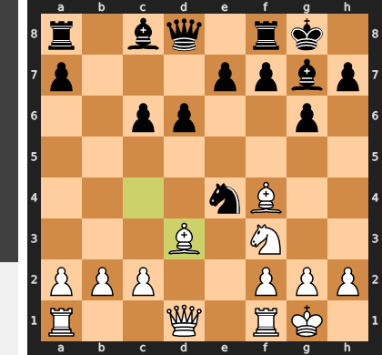

### Move 11 (Black): Bxb5
**Engine Recommendation:** The engine suggests `Nf6`, developing the knight and applying pressure to White's central pawn. This would help Black to create counterplay.
**Actual Move:** Black played `Bxb5`. This is a logical recapture, trading the knight for the bishop. However, White still has a strong central presence and a material advantage, so Black needs to find a way to activate their pieces and challenge White's control.
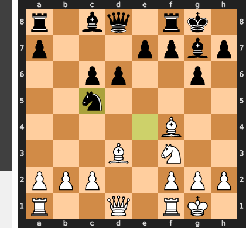

### Move 12 (White): Bxb5
**Engine Recommendation:** The engine suggests `Bxb5`. This is a strong move, recapturing the bishop and maintaining White's material advantage. White's evaluation is very high after this move.
**Actual Move:** White played `Bxb5`. This is a correct and strong recapture, maintaining White's material advantage and continuing to develop. White has a clear advantage in this position.
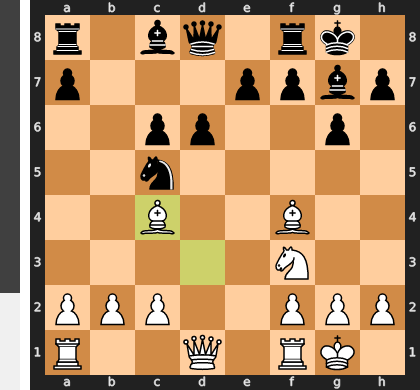

### Move 12 (Black): Qc7
**Engine Recommendation:** The engine suggests `Ne7`, developing the knight and preparing for kingside castling. This would help Black to consolidate their position.
**Actual Move:** Black played `Qc7`. This move connects the rooks and puts some pressure on White's d5 pawn. However, it leaves Black's kingside undeveloped and doesn't directly address the central problems. White still maintains a strong advantage.
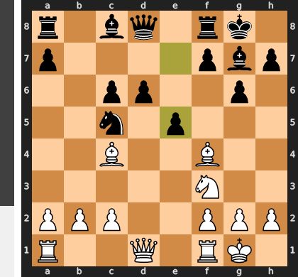

### Move 13 (White): Nd4
**Engine Recommendation:** The engine correctly suggests `Nd4`. This is a powerful move, bringing the knight to a central outpost, attacking Black's queen, and putting pressure on the c6 square. This move significantly increases White's advantage.
**Actual Move:** White played `Nd4`. Excellent! White continues to play strongly, bringing the knight to a dominant central square and creating immediate threats. Black is now under significant pressure and will have to react carefully.
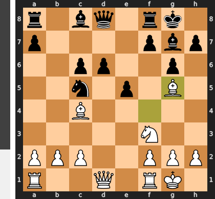

### Move 13 (Black): Kd8
**Engine Recommendation:** The engine suggests `Ne7`, developing the knight and preparing to castle kingside. This would help Black to create some counterplay and bring pieces into the game.
**Actual Move:** Black played `Kd8`. This move is a major concession. While it moves the king from the center, it prevents Black from castling, severely restricts the king's safety, and keeps the rook on h8 undeveloped. This move further increases White's already significant advantage.
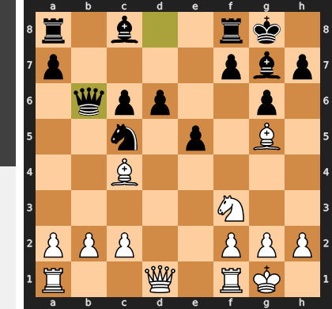

### Move 14 (White): Nxc6+
**Engine Recommendation:** The engine suggests `Bxc6`, which would win material and maintain White's overwhelming advantage. This would be a very strong move.
**Actual Move:** White played `Nxc6+`. This is also a strong move, winning material (the knight on c6) and further simplifying the position in White's favor. While the engine suggested `Bxc6`, `Nxc6+` is still an excellent move and leads to a winning position for White.
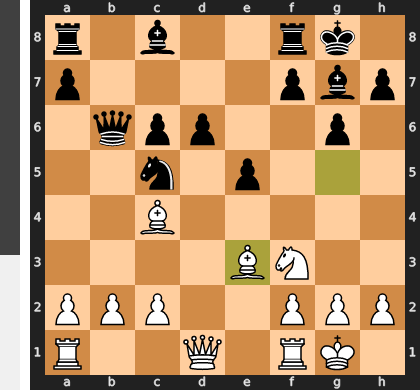

### Move 14 (Black): Kc8
**Engine Recommendation:** The engine suggests `Kc8`, as it is the only legal move to get out of check. This is a forced move.
**Actual Move:** Black played `Kc8`. This is the only legal move. Black's king is now very exposed, and White has a significant material and positional advantage.
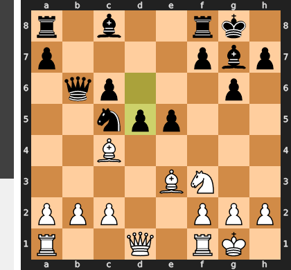

### Move 15 (White): Nd4
**Engine Recommendation:** The engine suggests `c4`, attacking Black's queen and creating further pressure. This would lead to a strong attack.
**Actual Move:** White played `Nd4`. This is another strong move, bringing the knight to a dominant central square, controlling key diagonals, and putting more pressure on Black's king and queen. White's pieces are very active and coordinated, leading to a decisive advantage.
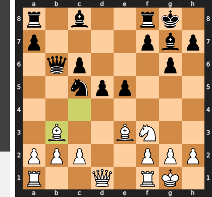

### Move 15 (Black): Rb8
**Engine Recommendation:** The engine suggests `Nf6`, developing the knight and trying to create some counterplay. This would be a more active defense.
**Actual Move:** Black played `Rb8`. This move brings the rook to an open file, which is generally a good idea. However, it doesn't address the immediate threats from White's centralized pieces and Black's king remains in a vulnerable position. Black's position is very difficult.
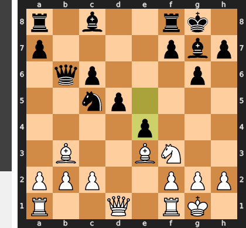

### Move 16 (White): Bxa4
**Engine Recommendation:** The engine suggests `Ba6+`, which would put the Black king in check and likely lead to a forced mate. This was a missed opportunity for a quicker finish.
**Actual Move:** White played `Bxa4`. This is a strong move, winning another pawn and further increasing White's material advantage. While `Ba6+` was a more forcing move, `Bxa4` still leads to a winning endgame for White. The focus is now on converting the material advantage.
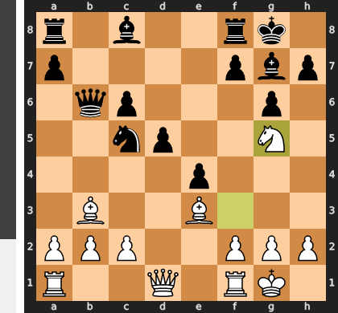

### Move 16 (Black): e5
**Engine Recommendation:** The engine suggests `Nf6`, which would develop the knight and try to offer some defense to the kingside. This would be a more prudent defensive move.
**Actual Move:** Black played `e5`. This move aims to open lines in the center and create counterplay. However, it also creates more weaknesses around the king and further exposes Black to White's attack. Black's position is crumbling.
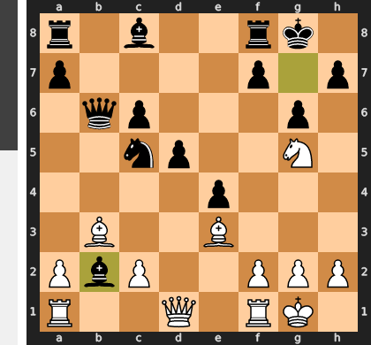

### Move 17 (White): Nb5
**Engine Recommendation:** The engine correctly suggests `Nb5`. This is a crushing move, attacking Black's queen and creating a devastating fork threat on c7. This move practically forces Black to lose more material.
**Actual Move:** White played `Nb5`. Excellent! White continues the attack with full force, creating immediate and serious threats. This move further highlights White's significant advantage and brings them closer to victory.
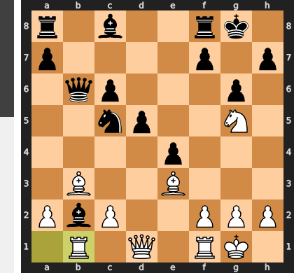

### Move 17 (Black): Qe7
**Engine Recommendation:** The engine suggests `Qe7`, as it is the only move to protect the c7 square and save the queen from the fork. This is a forced move.
**Actual Move:** Black played `Qe7`. This is a necessary move to protect the queen and prevent immediate disaster. However, Black's position remains very difficult, and White maintains a crushing advantage.
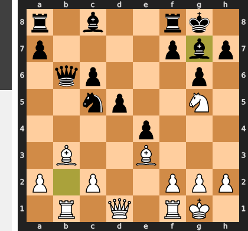

### Move 18 (White): Nxd6+
**Engine Recommendation:** The engine suggests `Qf3`, which would keep the pressure on Black's king and continue the attack. This would lead to a strong attack.
**Actual Move:** White played `Nxd6+`. This is a very strong move, winning another pawn and checking the king. It further increases White's material advantage and creates an even more precarious position for Black's king. White is now completely winning.
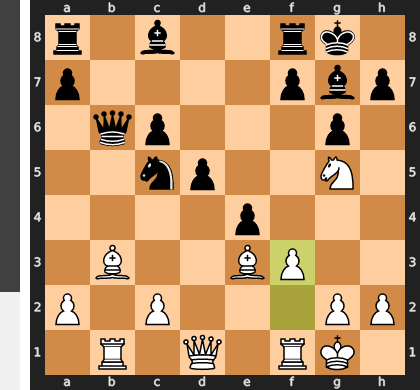

### Move 18 (Black): Qxd6
**Engine Recommendation:** The engine suggests `Qxd6`, as it is the only legal way to recapture and get out of check. This is a forced move.
**Actual Move:** Black played `Qxd6`. This is the forced recapture. Black's position is now lost, with a significant material deficit and an exposed king.
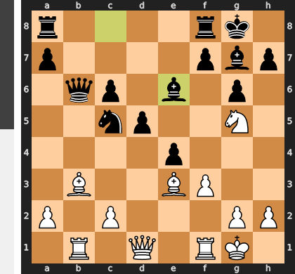

### Move 19 (White): Qxd6
**Engine Recommendation:** The engine suggests `Qe2`, which would develop the queen and connect the rooks. This maintains the pressure.
**Actual Move:** White played `Qxd6`. This is a good move, exchanging queens and simplifying the position. White has a clear material advantage and a very strong endgame. This exchange further solidifies White's winning position.
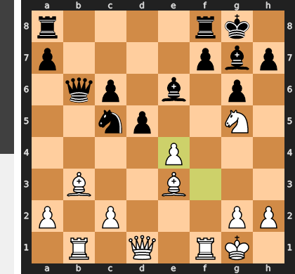

### Move 19 (Black): Bxd6
**Engine Recommendation:** The engine suggests `Bxd6`, as it is the only legal recapture. This is a forced move.
**Actual Move:** Black played `Bxd6`. This is the forced recapture. The queens are off the board, and White's material advantage will be easier to convert into a win in the endgame.
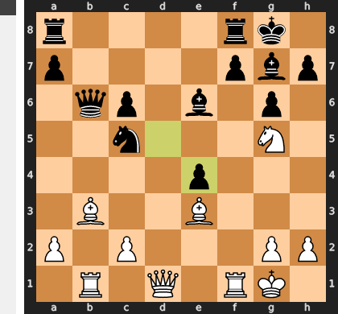

### Move 20 (White): Be3
**Engine Recommendation:** The engine suggests `Be3`, developing the bishop to an active square and connecting the rooks. This is a solid move.
**Actual Move:** White played `Be3`. This is a good developing move, bringing the bishop into the game and completing the development of White's minor pieces. White is now fully developed and has a significant material advantage, making the win inevitable.
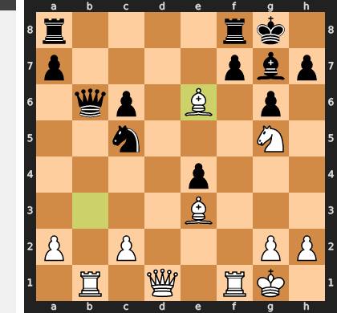

### Move 20 (Black): Nf6
**Engine Recommendation:** The engine suggests `Nf6`, developing the knight and bringing it to a more active square. This is a good developing move.
**Actual Move:** Black played `Nf6`. This is a sensible developing move, bringing the knight into the game and trying to create some counterplay. However, White's advantage is too great, and Black still has a difficult position to defend.
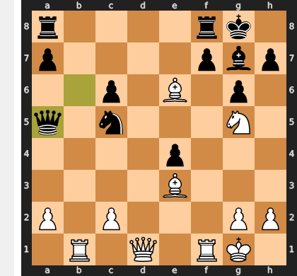

### Move 21 (White): f3
**Engine Recommendation:** The engine suggests `Rfd1`, bringing the rook to the open d-file and increasing pressure on Black's position. This would be a more active move.
**Actual Move:** White played `f3`. This move strengthens the e4 pawn and prevents any back-rank mate threats. While it's a solid and safe move, it is a bit passive and doesn't actively further White's attack. White could have played a more aggressive developing move to increase the pressure on Black.
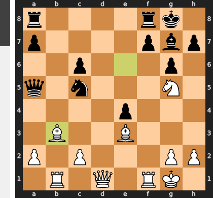

### Move 21 (Black): g6
**Engine Recommendation:** The engine suggests `Kd8`, trying to bring the king to safety and consolidate Black's position. This would be a more prudent defensive move.
**Actual Move:** Black played `g6`. This move creates an escape square for the king but also weakens the kingside. Black's position is still very difficult, and White continues to have a decisive advantage.
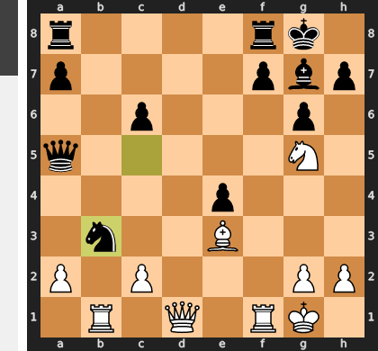

### Move 22 (White): Rfd1
**Engine Recommendation:** The engine correctly suggests `Rfd1`. This is an excellent move, bringing the rook to the open d-file, increasing pressure on Black's position, and preparing for further attacks. White's pieces are now very active and coordinated.
**Actual Move:** White played `Rfd1`. Excellent! White follows the engine's recommendation, bringing a powerful rook to the d-file, which is now open and provides a clear path to Black's king. White's attack is building, and Black is in a difficult situation.
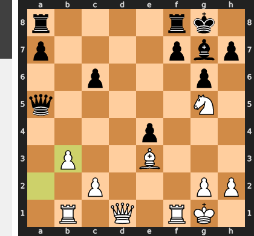

### Move 22 (Black): Rb6
**Engine Recommendation:** The engine suggests `Rd8`, which would defend the d-file and try to create some counterplay. This would be a more active defense.
**Actual Move:** Black played `Rb6`. This move brings the rook to the sixth rank, but it doesn't address the pressure on the d-file. Black's position remains difficult, and White continues to build up a decisive advantage. Black is struggling to find a way to defend their exposed king and weak pawns.
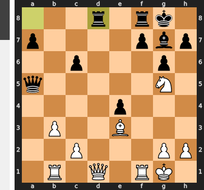

### Move 23 (White): Bxb6
**Engine Recommendation:** The engine correctly suggests `Bxb6`. This is a powerful move, winning Black's rook and creating an overwhelming material advantage. This move decisively seals the win for White.
**Actual Move:** White played `Bxb6`. Excellent! White captures the rook, leading to a completely winning endgame. Black cannot recover from this material loss, and White is now in a position to easily convert this advantage into a win.
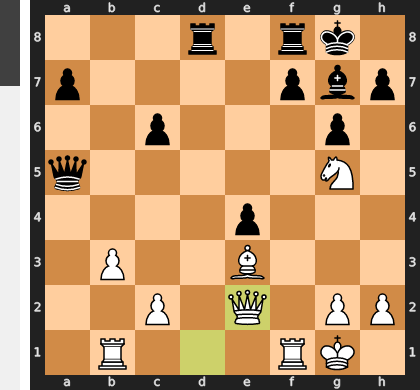

